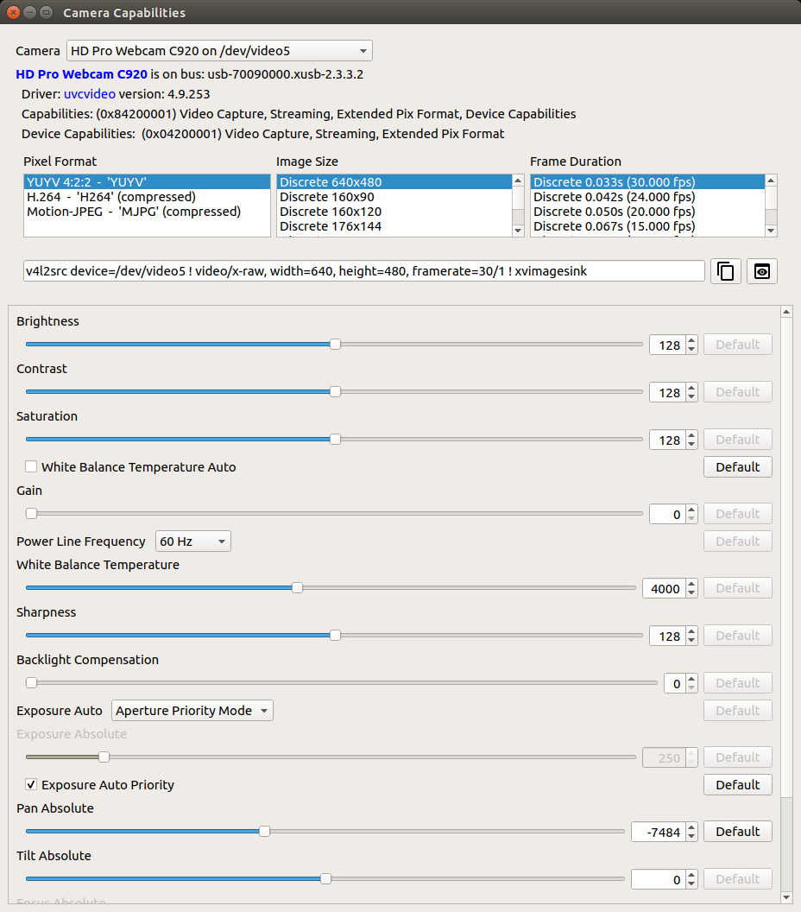

# camera-caps
This is a graphical user interface over the v4l2-ctl command line tool. This program supports an upcoming JetsonHacks article and video.

### Intended Spirit
This app is a simple software sketch built to support a demonstration. It is not fully featured, and certainly not production quality code, but you may find it useful for your own study and experimentation. 

On the NVIDIA Jetson family of products, connected cameras generally stream through the V4L2 module. USB cameras go through the uvcvideo
module which interfaces with the v4l2 module. Cameras connected through the CSI/MIPI ports (Raspberry Pi camera, GMSL cameras for example) interface with the tegra-video module, which in turn interfaces with the v4l2 module. 

Connected cameras show up as /dev/videoX (where X is the ID number) when connected with the proper drivers installed. Properly connected and registered, you can use the v4l2-ctl utility to examine the properties of the cameras. This includes the available pixel formats, frame sizes, frame rates, and properties. There are controls to adjust the properties of the camera. The GUI provides a consolidated view:



### Note
Not all cameras provide a V4L2 interface. Some cameras have proprietary interfaces that are not exposed through V4L2.

### Installation

```
$ sudo apt update
$ sudo apt install python3-pip
$ pip3 install dataclasses
# Install v4l2-ctl
$ sudo apt install v4l-utils
```
###  Running the Program
Before running the program, first make sure that the cameras you want to examine are attached. The program does not detect dynamic attachment. If you plug/unplug a camera, restart the program. Also note that USB cameras do not have a guaranteed address in their /dev/videoX designation. In other words, the address may change when the machine reboots or other cameras are added. To run:

```
$ python3 camera_caps.py
```

The preview button attempts to build a GStreamer pipeline and run it in a preview window. The preview window is not the full size of the video image size. 

## Releases
### January, 2022
* Initial Release
* JetPack 4.6, L4T 32.6.1
* Test on Jetson Nano, Jetson Xavier NX - Other Jetsons should work
